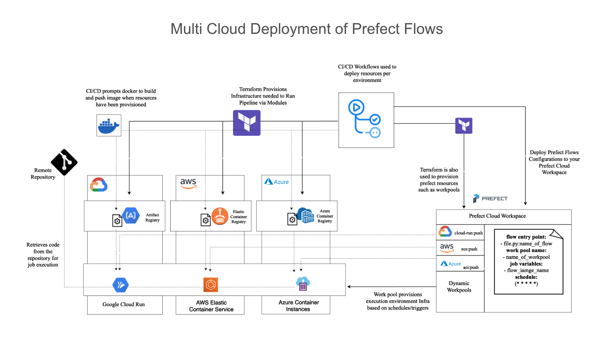

# Building a Modern Data Platform with Prefect as the Orchestrator

The primary objective of this project is to demonstrate the seamless deployment of Prefect flows to leading cloud environments—GCP, AWS, and Azure—while adhering to industry best practices. Key aspects of the project include:

- Logic Separation: Employing a clear distinction between orchestration and transformation logic ensures a modular and maintainable workflow.

- Infrastructure Provisioning with Terraform: Utilizing Terraform for infrastructure provisioning enables efficient management of all required resources, facilitating scalability and control.

- CI/CD for Deployment Management: Leveraging CI/CD practices ensures streamlined and automated deployments across different environments, promoting consistency and reliability.

The project encompasses several vital components essential for understanding its fundamental structure. It is essential to emphasize that the project is specifically tailored for serverless infrastructure, focusing on jobs well-suited for this environment.

## THE STACKS
For this project, we'll be utilizing key technology stacks to build a modern data platform. Here's an overview of the major components:

1) ### Prefect as Orchestrator:

    - Function: Handles scheduling, execution, flow management, and job monitoring.
    - Key Elements:
        - Workpool & Workers Configuration: Discusses the configuration of workpools and workers, essential for dynamic infrastructure scaling.
        - Prefect Deployments: Explores different deployment methods, with a focus on workpool-based deployment.
        - Infrastructure Options: Prefect supports serverless cloud providers like AWS ECS, GCP Cloud Run, and Azure Container Instance for flexible workflow execution.

2) ### GCP (Google Cloud Platform):

    - Service: GCP Cloud Run
    - Function: Google's serverless platform for running code in a Docker environment.
    - Dependency: Relies on Google Artifact Registry for accessing Docker images during execution.
    - Infrastructure Provisioning: Requires GCP infrastructure setup to support job execution.

3) ### AWS (Amazon Web Services):

    - Service: AWS ECS (Elastic Container Service)
    - Function: Fully managed container orchestration service for running Docker containers securely.
    - Dependency: Utilizes AWS Elastic Container Registry (ECR) for storing and accessing Docker images.
    - Infrastructure Provisioning: AWS infrastructure setup, including Fargate and ECR repositories, is essential for job execution.

4) ### Azure:

    - Service: Azure Container Instances (ACI)
    - Function: Serverless container service simplifying container deployment without infrastructure management.
    - Dependency: Relies on Azure Container Registry (ACR) for storing and accessing Docker images.
    - Infrastructure Provisioning: Requires Azure infrastructure setup, including ACI containers and ACR repositories.

5) ### Terraform:

    - Function: Infrastructure as Code (IAC) tool used to provision necessary infrastructure for deploying flows.
    - Role: Enables seamless and efficient management of infrastructure components for the entire platform.

By combining these stacks, we aim to create a robust and scalable modern data platform, leveraging the strengths of each technology to streamline workflow deployment and execution.

## FLOW OF WORK

To methodically build a scalable and modular data platform using Prefect, we can follow these step-by-step procedures:

### Working on Transformation Logic:
1) Define Tasks:
    - Clearly outline the tasks that need to be executed within the data platform.

2) Prefect Blocks Integration:
    - Incorporate Prefect blocks for specific tasks, such as reading data from cloud storage buckets.
    - Implement Prefect blocks for securely handling and accessing secrets.

### Working on Infrastructure Deployment:
1) Terraform Modules Setup:
    - Develop Terraform modules for essential resources:
        - Prefect WorkPools (GCP, Azure, AWS)
        - GCP Artifact Registry
        - AWS Elastic Container Registry
        - Azure Container Registry

2) Cloud Environment Deployment:
    - Utilize CI/CD for a build and release architecture to deploy Terraform modules to their respective cloud environments.
    - Configure environment secrets and variables to ensure secure and dynamic deployments.

3) Docker Image Management:
    - Build and push Docker images to each cloud environment.
    - Establish a seamless process for managing and updating Docker images.

4) Additional CI/CD Pipeline:
    - Implement an additional CI/CD pipeline for continuous integration and delivery of infrastructure changes.
    - Ensure automation of testing and validation processes in the CI/CD pipeline.

### Working on Prefect Deployment (Orchestration Logic):
1) YAML File for Deployment:
    - Construct the YAML file for Prefect deployment, specifying the flows and their corresponding workpools.

2) Deployment Configuration:
    - Manage deployment configurations, including specifying the execution environment for each workflow.

3) Repository Secret Tokens:
    - Set up repository secret tokens to enable Prefect to securely pull code (flows) during job execution.

4) Prefect Cloud Deployment:
    - Deploy the Prefect configuration to the Prefect Cloud using CI/CD.
    - Automate the deployment process to ensure consistency across different environments.

By systematically addressing each of these steps, we can establish a scalable and modular data platform using Prefect, effectively handling both transformation logic and infrastructure orchestration. This approach promotes maintainability, reliability, and scalability throughout the data platform's lifecycle.

## ARCHITECTURE DIAGRAM

The diagram below shows the project architecture explaining key concepts of all components involved.

The digram above covers all steps to get the infrastructure up and running, deploy the prefect flows and then submit a job for executution.

Github Action is used to deploy both the infrastructure and the prefect flows. Let's outline this in a more structure explanation:

1) Infrastructure Deployment with Terraform Modules: Terraform Modules are declared for prefect, aws, gcp and azure. Upon pushing the changes made to production, the resources will be provisioned in the appropraite cloud environemnt. The following resources are created per provider:
    - GCP: service account with permissions to run workloads on gooolge cloud run, artifact registry used to store the docker image.
    - AWS: IAM user, policies and permissions, network resources, and elastic container registry.
    - Azure: service principals with permissions to run workloads on azure container instance, azure container registry.
    - Prefect: prefect workpools used for organizing work for execution. For this project, three workpools were created (cloud-run:push, ecs:push, azure-container-instance push. Depending on the cloud stack of your choice, you choose to create one or make alternatives)
Upon deployment, these resources will be created all at once. Good thing is they can also be brought down all at once too.

2) Docker Image Build and Push: Once it has been guaranteed that the resources have been built, a workflow dispatch job then goes ahead to build the docker image and pushes it to any environment (GCP, Azur, AWS) docker image repositry.

3) Prefect Flows Deployment: The next step would be too deploy the prefect flows your prefect cloud workspace. This is also a workflow-dispatch job and it can act as a standalonbe deployment just incase you only want to make changes to the orchestration/scheduling logic. Prefect goves you a `.yaml` file that you can used to configure your prefect flows deployment. With this `.yaml` file, you can specify details relating to each flow deployment such as flow-name, entry-point, schedule, triggers, workpool, and job_variables. This configuration file also allows you configure where you want to store the code, and how it can be accessd during exexutiom, hence prefect does not have access to your code, and you can always pull from the mosr recent changes applied to your code. (Thereby separating transformation logic from orchestration logic) 

4) Running the job: The workpools handles provisioning of the serverless infrastructure (execution environment) when a trigger is hit or based of a schedule (it also allows for adhoc runs). The type of workpools used here is called "Push Workpools". In this case, there are no workers (no polling work pools for tasks), the workpools submit flow runs for execution to your serverless infrastructure that was built. Once the job has been completed, the serverless infrastucture is pulled down by the work pool.

## BENEFITS OF USING THIS ARCHITECTURE:
- Modular Infrastructure Deployment:
    - Terraform modules provide a modular approach to deploying infrastructure.
    - Resources across multiple cloud providers are provisioned consistently.

- Containerized Deployment:
    - Docker images encapsulate Prefect flows and ensure consistency across environments.
    - Docker images are stored in cloud-specific container registries.

- Separation of Concerns:
    - Separation between infrastructure deployment, Docker image management, and Prefect flow deployment.
    - Prefect YAML configuration file separates transformation logic from orchestration logic
    
- Serverless Execution:
    - Prefect workpools enable serverless infrastructure provisioning for job execution.
    - Resources are dynamically scaled based on workload.

By following this structured workflow, you achieve a scalable and modular data platform with efficient separation of concerns and seamless integration with Prefect, AWS, GCP, and Azure.